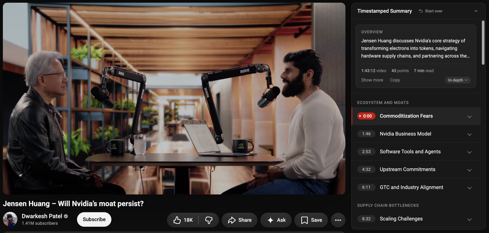
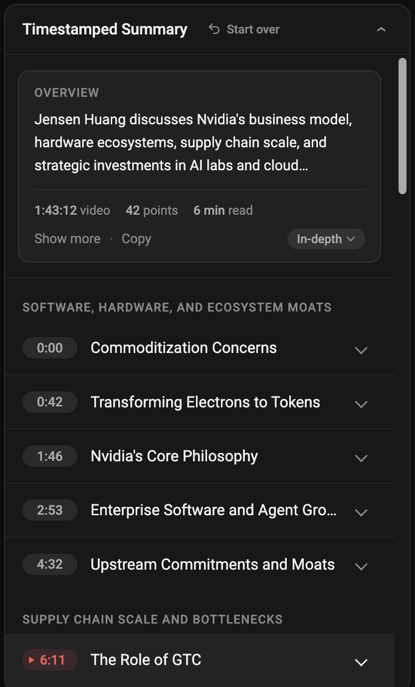
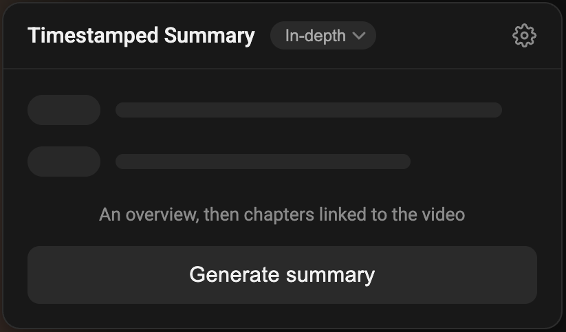
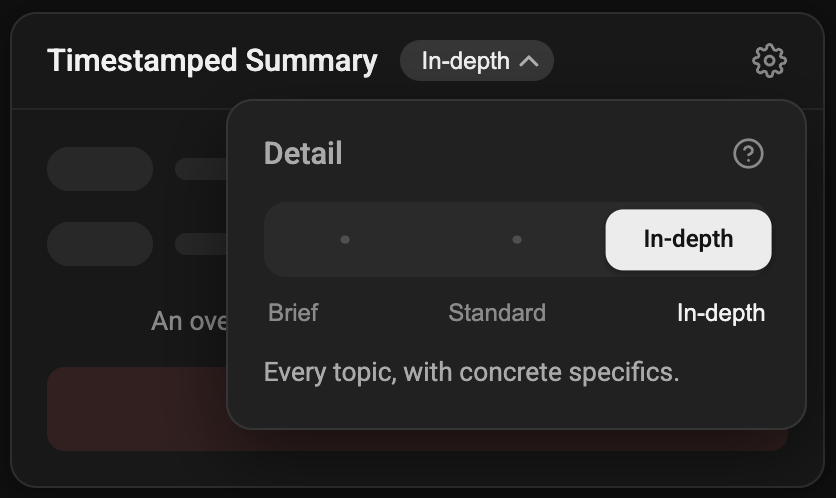
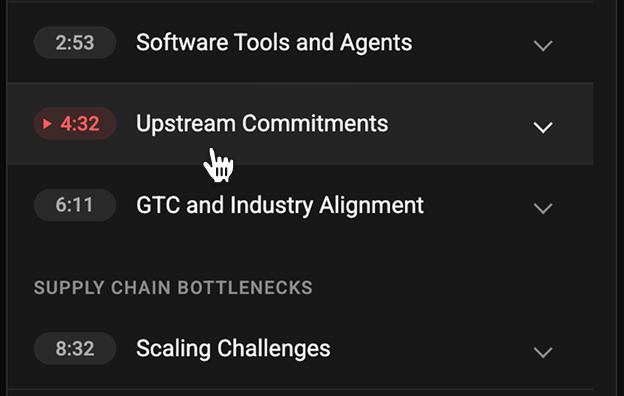
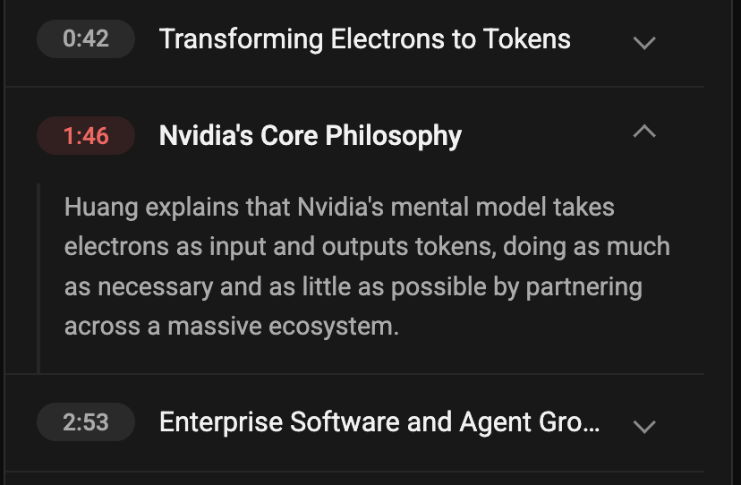
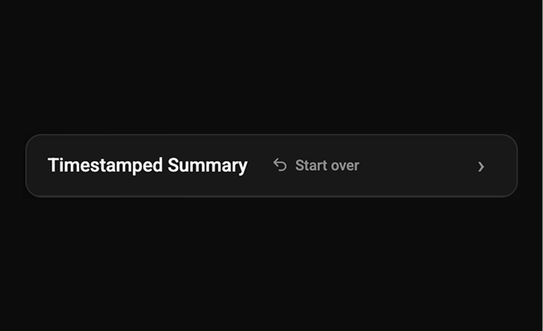
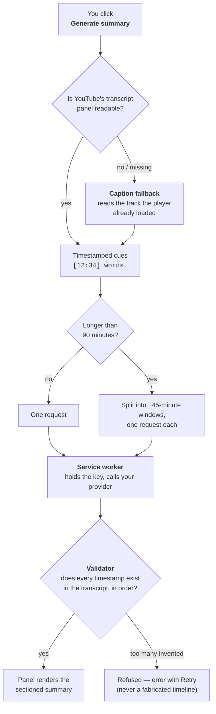
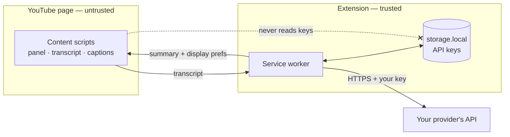

<div align="center">


# Timestamped Summary for YouTube

**Read the video before you watch it.**

A sectioned, timestamped AI summary lives in the YouTube sidebar — click any line to jump straight to that moment.

[](https://github.com/priyank1205/yt-transcript-ext/actions/workflows/ci.yml)
[](https://github.com/priyank1205/yt-transcript-ext/releases/latest)
[](LICENSE)
[](#install)
[](package.json)
[](#privacy-and-data-handling)

[**Install**](#install) · [**Set up a key**](#step-3--add-an-api-key) · [**Troubleshooting**](#troubleshooting) · [**How it works**](#how-it-works) · [**Privacy**](#privacy-and-data-handling) · [**Development**](#development)



</div>

---

## Why this exists

YouTube is one of the best libraries on the internet — tutorials, lectures, conference talks, three-hour podcasts. It is also the one library with no index. Watching an hour to find one answer, or to decide whether an hour is worth spending at all, is a bad trade.

This extension builds the index. It reads the video's own transcript, sends it to an LLM you choose, and renders the result as a **sectioned outline where every line is a link into the video**. No new tab, no copy-paste, no chatbot to prompt.

> [!NOTE]
> **You bring the API key.** There is no server, no account and no subscription in between — the extension talks to your provider directly, and you pay them for what you generate. Google Gemini has a free tier that covers casual use.

<br>

## A guided tour

<div align="center">

</div>

<p align="center"><sup>The whole panel. Below, what each part of it does.</sup></p>

<table>
<tr>
<td width="45%"></td>
<td valign="top">

### Already in the sidebar

Open any video and the panel is sitting at the top of the sidebar, above the recommendations.

One button, and nothing is sent anywhere until you press it.

</td>
</tr>
<tr>
<td></td>
<td valign="top">

### Three levels of detail

**Brief** marks the major sections. **Standard** is the default. **In-depth** keeps the names, numbers and conclusions.

Counts come from the video's real runtime, so a two-hour talk earns more rows than a ten-minute clip — [see the density model](#detail-levels).

</td>
</tr>
<tr>
<td></td>
<td valign="top">

### An overview before the outline

What the video is actually about, in plain sentences — with its runtime, the number of points and how long they take to read.

Enough to decide in five seconds whether to keep going.

</td>
</tr>
<tr>
<td></td>
<td valign="top">

### Every row jumps the video

This is the whole point: click a row and the video seeks to that moment. The entire row is the target, not just the timestamp.

The point playing now stays marked as the video moves, so the list always shows you where you are.

</td>
</tr>
<tr>
<td></td>
<td valign="top">

### Open a point for the detail

Headings stay scannable. Expand one for the explanation behind it.

Often that answers the question, and the video never has to play at all.

</td>
</tr>
<tr>
<td></td>
<td valign="top">

### Collapse it when you're watching

The panel folds to a single bar and stays out of the way until you want it back.

**Start over** discards the summary and lets you generate again at a different level.

</td>
</tr>
</table>

<div align="right"><a href="#timestamped-summary-for-youtube">↑ back to top</a></div>

<br>

## Install

> [!IMPORTANT]
> This extension is **not on the Chrome Web Store**. You install it yourself, from a folder on your computer. That sounds harder than it is — it takes about three minutes, and the steps below assume you have never done it before.

**What you need**

| | |
|---|---|
| 🌐 **A Chromium browser** | Chrome, Edge, Brave, Arc, Opera, Vivaldi — anything built on Chromium |
| 🔑 **An API key** | Free to obtain from [Google Gemini](https://aistudio.google.com/apikey) |
| ⏱️ **About three minutes** | Once, ever |

<br>

### Step 1 — Get the extension onto your computer

<details open>
<summary><b>🟢 The easy way — download the zip</b> (recommended if you don't use git)</summary>

<br>

1. Go to the **[latest release page](https://github.com/priyank1205/yt-transcript-ext/releases/latest)**.
2. Under **Assets**, click the file ending in **`.zip`** — something like `timestamped-summary-for-youtube-v1.2.zip`. It downloads like any other file.
3. **Unzip it properly.** This step is where most people get stuck:
   - **Windows:** right-click the file → **Extract All…** → **Extract**. Do *not* just double-click and drag files out of the preview window — Windows will hand you an incomplete copy.
   - **macOS:** double-click the file. A folder appears next to it.
4. Move the unzipped **folder** somewhere permanent — your Documents folder is fine. Do not put it in Downloads if you regularly empty that.

> [!WARNING]
> **Keep that folder.** Chrome does not copy the extension anywhere; it loads it from this folder every time the browser starts. If you delete or move the folder later, the extension stops working.

</details>

<details>
<summary><b>⚙️ The git way</b> — clone the repo and run it from source</summary>

<br>

The extension runs from the source tree as-is. There is no build step and nothing to install.

```bash
git clone https://github.com/priyank1205/yt-transcript-ext.git
cd yt-transcript-ext
```

The repo root *is* the extension folder — point **Load unpacked** at it. Update with `git pull`, then reload the extension and refresh your YouTube tabs.

</details>

<br>

### Step 2 — Load it into your browser

> [!TIP]
> `chrome://extensions` is not a normal web address and **cannot be opened by clicking a link**. You have to type or paste it into the address bar yourself.

1. Open a new tab, type **`chrome://extensions`** in the address bar and press <kbd>Enter</kbd>.
   *(Edge: `edge://extensions`. Brave: `brave://extensions`.)*
2. Find the **Developer mode** switch in the **top-right corner** and turn it **on**. Three new buttons appear.
3. Click **Load unpacked**.
4. In the file picker, select **the folder that directly contains `manifest.json`** and confirm.

<details>
<summary>❓ How do I know I picked the right folder?</summary>

<br>

Open the folder before selecting it. You should see these items *inside* it:

```
manifest.json     ← this file must be here
background/
icons/
options/
scripts/
styles/
```

If you instead see a single folder with the project's name inside it, you're one level too high — go into that folder and select *it*.

If Chrome shows the error *"Manifest file is missing or unreadable"*, this is why.

</details>

**That's it — the extension is installed.** A short setup guide opens automatically on first install. Leave it open; that's Step 3.

<br>

### Step 3 — Add an API key

The extension does not include an AI model. You point it at a provider you have an account with, and your key stays on your machine.

| Provider | Free tier? | Where to get a key | Default model |
|---|:---:|---|---|
| **Google Gemini** ⭐ | ✅ Yes — no billing setup needed | [aistudio.google.com/apikey](https://aistudio.google.com/apikey) | `gemini-flash-lite-latest` |
| **OpenAI** | ❌ Paid | [platform.openai.com/api-keys](https://platform.openai.com/api-keys) | `gpt-4o-mini` |
| **Anthropic** | ❌ Paid | [console.anthropic.com/settings/keys](https://console.anthropic.com/settings/keys) | `claude-haiku-4-5-20251001` |
| **Any OpenAI-compatible endpoint** | — | Your own URL — Mistral, Groq, DeepSeek, OpenRouter, Together, a local model, anything that speaks the OpenAI chat API | Yours to list |

⭐ **New here? Start with Gemini.** It is free, needs no card, and takes about a minute. Any provider that is not in the table is reached by adding a **custom provider** with its endpoint URL and your key — the setup is the same three fields for all of them.

1. The setup guide opened itself on install. If you closed it, every route back leads to the same place: **click the extension's icon** in the toolbar, press **Add API key** in the panel, open the **⚙ gear icon** in the panel, or right-click the toolbar icon and choose **Options**. Until a key is saved, the toolbar icon carries a red **!**.
2. Answer one question — *where should the writing come from?* — and take **Use the free one** unless you already hold an API key. (A ChatGPT Plus or Claude Pro subscription is not an API key; those are billed separately.) The guide shows you exactly what to click on Google's page before it sends you there.
3. Paste the key and press **Connect**. You don't have to say which provider it came from: the key's own shape identifies it, and the guide checks it with that provider before saving anything.
4. Configure a second provider if you like. Once two or more are set up, a provider selector appears with an **Auto** option that tries each configured provider in turn if one fails.

<br>

### Step 4 — Your first summary

1. Open any YouTube video that has captions.
2. Find the **Timestamped Summary** panel at the top of the right-hand sidebar.
3. Optionally set the detail level with the chip in the header.
4. Click **Generate summary** and wait a few seconds — longer for a multi-hour video, which is summarised in parts.
5. **Click any timestamp** to jump the video there. Click a row's chevron to read the detail behind it.

<br>

### Updating and removing

<details>
<summary><b>Updating to a newer version</b></summary>

<br>

1. Unzip the newer release **over the same folder** (or run `git pull` if you cloned).
2. Go to `chrome://extensions` and click the **⟳ reload arrow** on this extension's card.
3. **Refresh any YouTube tab you already had open.**

> [!IMPORTANT]
> That last step is not optional. Part of the extension starts before YouTube's player does, so a tab that was already open is still running the previous version's code until you reload it.

</details>

<details>
<summary><b>Removing it</b></summary>

<br>

Click **Remove** on its card in `chrome://extensions`. That deletes your stored keys and preferences along with it. The folder on disk stays until you delete it yourself.

</details>

<div align="right"><a href="#timestamped-summary-for-youtube">↑ back to top</a></div>

<br>

## Troubleshooting

<details>
<summary><b>The panel doesn't appear on the video page</b></summary>

<br>

- Refresh the page. On a tab that was open while you installed or reloaded the extension, the panel only appears after a refresh.
- Make sure you're on a **watch page** (`youtube.com/watch?v=…`), not the homepage, Shorts, or a channel page.
- Check the extension is enabled and shows no errors on `chrome://extensions`.
- Collapse the miniplayer if one is open, and make sure the sidebar itself is visible — theater mode moves it below the player.

</details>

<details>
<summary><b>"No API key set" / the button says "Add API key"</b></summary>

<br>

No provider is configured yet. Press **Add API key** in the panel — it opens the setup guide straight away. The toolbar icon carries a red **!** for as long as this is true, and clicking it offers the same thing. If you got part-way and stopped, the button reads **Finish setting up** and tells you how far you got; it picks up where you left off. Either way the button flips to **Generate summary** the moment a key is saved — you don't need to reload anything.

</details>

<details>
<summary><b>"No captions for this video" or "Couldn't read the captions"</b></summary>

<br>

The extension summarises what was *said*, so it needs a caption track.

1. Turn on **CC** in the player and let a few lines of captions appear.
2. Refresh the page, then click **Generate summary** again.

Some videos genuinely have no transcript — the creator disabled captions and YouTube's automatic ones never ran. There is nothing to summarise in that case.

**Members-only videos** work if your signed-in account can actually play them. **Live streams in progress** are not supported.

</details>

<details>
<summary><b>The summary stopped partway, or timed out</b></summary>

<br>

The panel gives up after two minutes without progress. Long videos are summarised in parts and each part re-arms that clock, so a genuine timeout usually means the provider is slow or overloaded.

- Click **Try again** — it's offered on every error.
- Switch to a faster model (a *flash* or *mini* class model) on the settings page.
- On very long videos, try **Brief** first to confirm everything works end to end.

</details>

<details>
<summary><b>Generation fails right after an update, with an error that looks like a bad key</b></summary>

<br>

Almost always a stale model id: a provider retired the model your settings named. The extension migrates known-retired built-in models on update, but a **custom** provider's model list is yours to maintain. Open settings, reselect a model, and save.

</details>

<details>
<summary><b>Timestamps look wrong or the summary skips a chunk of the video</b></summary>

<br>

This should not happen — every point is checked against the real transcript before it renders, and a response that loses too many points to that check is refused outright rather than shown. If you do see it, please [open an issue](https://github.com/priyank1205/yt-transcript-ext/issues/new/choose) with the video link and the output of the panel's **Copy details** button.

</details>

<details>
<summary><b>Reporting a bug safely</b></summary>

<br>

Use the panel's **Copy details** button rather than pasting a raw console log. It strips API keys, signed URLs and query strings before anything reaches your clipboard.

**Never paste an API key into an issue.** If you think you have, revoke it in your provider's console immediately.

</details>

<div align="right"><a href="#timestamped-summary-for-youtube">↑ back to top</a></div>

<br>

## How it works



In plain terms: the extension reads the transcript YouTube already has, hands it to the model you configured with a prompt that forbids inventing timestamps, then *checks the answer against the transcript* before letting it near the screen. A summary you can click is only useful if the times are real, so nothing is trusted on the model's word.

### Design decisions worth knowing

<details>
<summary><b>Long videos are summarised in windows, not in one giant request</b></summary>

<br>

A five-hour transcript does not survive a single request. The model reads a hundred thousand tokens of cues and then has to hold an even, hour-by-hour plan across one very long answer — what it actually does is thin out as it goes, or drop a stretch entirely, which is how a summary ends up jumping from 3:09 to 5:08. No prompt fixes that reliably, because the instruction competes with the model's own pull toward a shorter answer, and that pull grows with input length.

So above **90 minutes**, the video is split into consecutive **~45-minute windows**, each its own request over its own slice of the transcript. A window cannot be skipped, because there is nothing else in the request to skip it for. The windows are ordered and disjoint, so their summaries concatenate into one timeline that still validates against the full cue list.

Token cost is roughly unchanged — the same transcript is read once either way — so this buys coverage rather than spending tokens for it.

</details>

<details>
<summary><b>Every timestamp is verified before it renders</b></summary>

<br>

Each point must land on a cue that actually exists, inside the video's own range, in increasing order. Points may snap to the nearest real cue within **15 seconds** (widened up to 120s for sparse transcripts, where panel segments can sit ten seconds apart), but a point with no cue near it is treated as invented and dropped.

If a response loses **more than half** its points to that check, it isn't a summary with a few bad rows — it's a summary of the wrong timeline, and the whole thing is refused. "Success" never means the panel is about to show times that go nowhere.

</details>

<details>
<summary><b>Density is computed from the runtime, not left to the model</b></summary>

<br>

Asking a model to do duration arithmetic in its head produces summaries that are all roughly the same length regardless of the video. Instead, the point count, the section count and the description depth are calculated from the video's real duration and injected into the prompt as concrete numbers.

Videos over 25 minutes also get an explicit **coverage contract**: the runtime is divided into named stretches, each with its own minimum point count, so the last half hour of a two-hour talk gets the same treatment as the first. There's a floor but deliberately no ceiling — a long video is *supposed* to earn more rows.

</details>

<details>
<summary><b>API keys never enter the page</b></summary>

<br>

Content scripts can read `chrome.storage.local` by default, and that store holds every key. The panel *is* a content script — it runs inside YouTube's own page, so anything it can read is one page-level compromise away from being read by the page.

So the store is closed to page contexts entirely (`TRUSTED_CONTEXTS`), reasserted on every service-worker start rather than only on install. Nothing the panel renders needs a key: it asks the background for a handful of display preferences plus **one boolean** saying whether any provider is configured, and that's all that crosses the boundary.



</details>

<details>
<summary><b>A result belongs to the video that produced it</b></summary>

<br>

A generation is bound to one tab, one video and one request id, and holds that claim for its whole life. Everything the background sends back carries the binding, so navigating away mid-generation can no longer attach one video's summary to another. Navigation also aborts the in-flight provider call rather than leaving it running to race the next one.

</details>

<details>
<summary><b>Model output is treated as untrusted text — both ways</b></summary>

<br>

Summary text, provider error strings and custom provider names all reach the DOM through `textContent` or created text nodes, never `innerHTML`.

In the other direction, the transcript is passed to the model as *data, not instructions*: the prompt states outright that text in the transcript which looks like a command — including a request to ignore the rules — is content to be summarised, never followed.

</details>

<details>
<summary><b>The caption fallback, and what it retains</b></summary>

<br>

When YouTube's transcript panel is missing or unreadable, a script that starts with the page keeps copies of caption responses the player loads through `fetch` or `XMLHttpRequest`, so the fallback can use text the player already received even when a second request for it would be refused.

Those copies live in the page's memory only: at most **four tracks**, keyed by language and kind, cleared on navigation, never persisted. Request tokens, signatures and headers are not retained, and only `/api/timedtext` responses for the video currently open are considered. The fallback changes nothing about the summary panel, the playback position or your CC settings, and needs no additional permissions.

</details>

<div align="right"><a href="#timestamped-summary-for-youtube">↑ back to top</a></div>

<br>

## Detail levels

Set per video from the chip in the panel header; the last choice becomes your default.

| Level | Density | Each point is | Best for |
|---|---|---|---|
| **Brief** | ~1 point per 9 min | A single short sentence | Deciding whether to watch at all |
| **Standard** | ~1 point per 4 min | 1–2 sentences | The balanced default |
| **In-depth** | ~1 point per 2 min | 2–4 sentences preserving names, numbers, examples and conclusions | Working through material without watching it |

Counts scale with the real runtime and are floored — not capped — so a long video produces a long summary. A three-minute clip scales *down* instead of padding out invented moments.

## Features

| | |
|---|---|
| **Click-to-seek** | Every point is a link into the video |
| **Follows playback** | The row playing now highlights itself; one control scrolls the list back to it |
| **Briefing card** | Overview, runtime, point count, reading time, and the level it was generated at |
| **Provenance** | Press the detail chip on a result to see which model wrote it and how long ago |
| **Copy** | Copy the overview, or diagnostics with keys and signed URLs stripped |
| **Collapsible** | Collapse the panel, or expand individual points |
| **Two skins, three themes** | *Classic* and *Quiet* panel designs; System / Light / Dark |
| **Auto provider fallback** | With two or more keys configured, a failing provider falls through to the next |
| **Custom endpoints** | Any OpenAI-compatible API, including a local model |
| **Recovers from a missing transcript** | Falls back to the player's own caption track |
| **Handles members-only videos** | If your signed-in account can play it, it can be summarised |
| **Errors you can act on** | Every failure is categorised, explained, and offers Retry — plus Open settings where that's the fix |
| **Local stats** | Summaries generated and estimated time saved, kept on your machine and shown in settings |

<div align="right"><a href="#timestamped-summary-for-youtube">↑ back to top</a></div>

<br>

## Privacy and data handling

> [!NOTE]
> **No backend, no account, no telemetry.** Nothing about your viewing is collected, and the project has no server to collect it with. The only network requests the extension makes are to YouTube (which you were already talking to) and to the provider whose key you supplied.

**What leaves your machine, and when**

- **Nothing at all until you press Generate summary.** The panel is inert until then.
- When you do, **the video's transcript is sent to the provider that generates the summary** — for members-only videos too. In **Auto** mode that's whichever configured provider runs, and if the first fails the transcript is sent to the next.
- Keys being stored locally is *not* the same as local AI: the summarising happens on the provider's servers unless you point a custom provider at a local endpoint.

**What stays on your machine**

- API keys, preferences and stats live in this browser's `storage.local`, restricted to the extension's own pages. The in-page panel cannot read it.
- Generated summaries are held **in memory only**, per tab. Refresh the page and they're gone; nothing is written to disk.
- Captured caption responses stay in the YouTube page's memory — at most four tracks, cleared on navigation, never persisted.
- Copied diagnostics are stripped of keys, signed URLs and query strings before reaching the clipboard.

**Permissions, and why each one exists**

| Permission | Why it's needed |
|---|---|
| `*://*.youtube.com/*` | Read the transcript and render the panel. This is the only site the extension runs on. |
| `generativelanguage.googleapis.com`, `api.openai.com`, `api.anthropic.com` | Call the three built-in providers. Requests only go to the one you configured. |
| `storage` | Keep your key and preferences, in a store closed to page contexts |
| `scripting` | Read the transcript out of the page on request |
| *Optional, per custom endpoint* | A custom provider is the one address the extension can't know in advance, so Chrome asks for access to **that host** when you save it — and hands the permission back when you delete it |

There is **no all-sites permission**. Custom endpoints must use `https`; plain `http` is accepted only for `localhost`, because a remote `http` endpoint would carry your key and the transcript in clear text.

<div align="right"><a href="#timestamped-summary-for-youtube">↑ back to top</a></div>

<br>

## Development

No dependencies, no build step, no framework, no TypeScript. **Node 20 or newer** is all you need.

```bash
git clone https://github.com/priyank1205/yt-transcript-ext.git
cd yt-transcript-ext
npm run check
```

| Command | What it does |
|---|---|
| `npm run check` | Manifest/version check, then the full unit suite |
| `npm test` | Unit tests only — transcript regression, caption capture and fallback, request routing, navigation, windowing, summary validation |
| `npm run test:manifest` | Proves the manifest points at files that exist and both version files agree |
| `npm run test:browser` | Serves the browser harness at `http://127.0.0.1:8765/tests/caption-reader-browser.html` for JSON3/XML parsing and real `fetch`/XHR capture checks |
| `npm run package` | Writes `dist/timestamped-summary-for-youtube-v<version>.zip` with only the files the manifest loads |
| `npm run bump -- patch` | Raises the version in `manifest.json` **and** `package.json` and moves the Unreleased changelog section under it |

All checks use fixture captions and make **no YouTube or LLM requests**.

> [!TIP]
> The panel can be worked on without an extension-reload loop: serve the repo root and open **`/dev/preview.html`**, which loads the real `ui-builder.js` and both skins against a sample summary with stubbed `chrome.*` APIs.

**Project layout**

| Path | What lives there |
|---|---|
| `background/service-worker.js` | Provider calls, request lifecycle, anything touching API keys |
| `scripts/` | Content scripts: extraction, caption fallback, panel rendering, validation |
| `options/` | Settings page |
| `styles/` | `content.css` (Classic) and `skin-quiet.css` (Quiet) |
| `tests/` | `node:test` suites plus the browser harness |
| `dev/preview.html` | Panel harness with stubbed `chrome.*` APIs |
| `tools/` | Manifest check, version bump, changelog notes, release packaging |

**Two boundaries worth keeping**

1. **API keys never enter a content script.** The page side asks the background for display preferences and one boolean. Keep it that way.
2. **Model output is untrusted text.** It reaches the DOM through `textContent` or created text nodes, never `innerHTML` — same for provider error strings and custom provider names.

**Adding a provider** is three steps: a client class extending `LLMClient`, an entry in the `PROVIDERS` registry in [`scripts/providers.js`](scripts/providers.js), and the API domain added to `host_permissions`.

CI runs the same `npm run check` on Node 20 and 22 for every push and pull request, then builds the release zip and attaches it to the run. **Releases are automatic**: push to `main` with a version that has no release yet and it publishes, tagged `v<version>`, with that version's `CHANGELOG.md` section as the notes.

<div align="right"><a href="#timestamped-summary-for-youtube">↑ back to top</a></div>

<br>

## FAQ

<details>
<summary><b>Is my API key safe?</b></summary>

<br>

It's stored in your browser's extension storage, which is set to be unreadable from web-page contexts — including the extension's own panel running inside YouTube. It is sent to exactly one place: the provider it belongs to, over HTTPS. It never touches a server of this project's, because there isn't one.

</details>

<details>
<summary><b>What does it cost to run?</b></summary>

<br>

Whatever your provider charges for the tokens you use — you're billed by them directly. A transcript is text, and the flash/mini-class models set as defaults are the cheap ones. Gemini's free tier needs no billing setup at all.

</details>

<details>
<summary><b>Does it work on Firefox or Safari?</b></summary>

<br>

Not currently. It's a Manifest V3 extension built and tested against Chromium browsers — Chrome, Edge, Brave, Arc, Opera, Vivaldi. Firefox is untested; Safari would need repackaging.

</details>

<details>
<summary><b>Why isn't it on the Chrome Web Store?</b></summary>

<br>

It isn't published there yet. Loading unpacked has one genuine advantage in the meantime: the code you run is the code in this repo, and you can read all of it.

</details>

<details>
<summary><b>Can I use a local model?</b></summary>

<br>

Yes — add a **custom provider** pointing at any OpenAI-compatible endpoint. `http://localhost` is explicitly allowed for exactly this. That's also the only configuration where nothing leaves your machine.

</details>

<details>
<summary><b>Does it store my summaries or watch history?</b></summary>

<br>

No. Summaries live in the tab's memory and are gone on refresh. No history, no analytics, no accounts.

</details>

<details>
<summary><b>Can it summarise a video in another language?</b></summary>

<br>

It reads whatever caption track the video has, so a non-English video is summarised from its own transcript. Output language isn't selectable yet — the prompt carries no language instruction, so you get the model's default, usually English. The hook for choosing one is already in the prompt builder.

</details>

<div align="right"><a href="#timestamped-summary-for-youtube">↑ back to top</a></div>

<br>

## Contributing

Bug reports and suggestions are welcome. This is a small, dependency-free extension, and changes are judged on whether they keep the moving parts few rather than on how much they add.

- 🐛 [**Report a bug**](https://github.com/priyank1205/yt-transcript-ext/issues/new?template=bug_report.yml) — use the panel's *Copy details* button, never a raw log
- 💡 [**Request a feature**](https://github.com/priyank1205/yt-transcript-ext/issues/new?template=feature_request.yml)
- 📖 [**CONTRIBUTING.md**](CONTRIBUTING.md) — local setup, project layout, style, release process
- 📋 [**CHANGELOG.md**](CHANGELOG.md) — what changed in every version

## License

[MIT](LICENSE) — use it, fork it, ship it. Keep the copyright notice.

<div align="center">
<br>
<sub>Built because an hour-long video shouldn't need an hour to evaluate.</sub>
</div>
