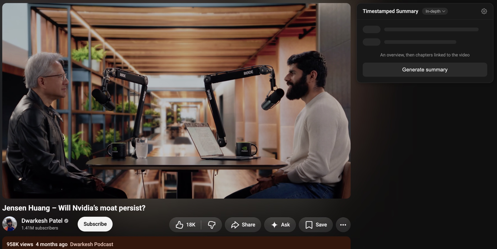

# Timestamped Summary for YouTube

*Previously released as "YouTube Transcript Extractor".*

YouTube videos are diamond mines of knowledge on the internet — tutorials, talks, deep dives, podcasts. But watching an hour-long video just to find one answer, or to decide if it's worth your time, is painfully inefficient.

This extension gives you a **timestamped, sectioned AI-generated summary** directly inside the YouTube page. Click any summary line to seek the video to that moment. No tabs, no copy-paste, no friction.

Screenshots show a public video from the Dwarkesh Podcast.

**Features:**

- Extracts timestamped text from YouTube's transcript panel, with a player-caption fallback when the transcript is missing or unreadable
- Generates a structured, sectioned summary using an LLM (supports multiple providers like Gemini, Mistral, etc.)
- Opens with a briefing card above the chapter list: a short overview of the video, the runtime, the number of points and the reading time, and the detail level used
- Every summary point is linked to its exact video timestamp — click to seek
- Expand a summary point to see in detail
- Collapse/expand the complete panel
- Model selector with Auto mode (falls back across available configured providers)
- Supports readable manual and auto-generated caption tracks, including members-only videos your signed-in account can play

**A closer look:**

Choose how much detail you want before generating. Brief for a quick read of what a video covers, In-depth when you intend to work through it.

The result opens with a briefing card — a short overview, the video's runtime, how many points it found and how long they take to read — above the sectioned chapter list.

Click a row's timestamp to seek the video there, or expand it for the explanation behind the heading.

Collapse the whole panel when you would rather just watch.

**How it works:**

1. Open any YouTube video
2. A "Timestamped Summary" panel appears in the sidebar
3. Click **Generate summary**
4. The extension extracts the transcript, sends it to the LLM, and renders a timestamped, sectioned summary
5. Click any `[timestamp]` line to jump to that moment in the video

The existing transcript-panel flow is tried first. If it fails, the extension reads the player's caption track in the same signed-in YouTube page and passes the same timestamped text format to the summarizer. A small script starts with the page and retains copies of caption responses loaded through fetch or XMLHttpRequest, so the fallback can use the text the player already received even when a second request is rejected. These copies stay in page memory, are limited to four tracks, and are cleared on navigation; request tokens and headers are not retained. The fallback does not change the summary panel, playback position, or CC settings, and needs no additional permissions.

After updating the extension, reload it on Chrome's Extensions page **and refresh the YouTube tab** so caption capture starts before the player loads captions. Keep **CC** enabled, let some captions appear, and click **Generate summary**. Members-only videos require your account to have access; caption availability alone does not guarantee a readable track. Active live streams are not supported by the caption fallback.

**Permissions and data handling:**

- Site access is limited to `youtube.com` and the four built-in provider APIs (Gemini, OpenAI, Anthropic, Mistral). There is no all-sites permission.
- A custom provider is the one endpoint the extension cannot know in advance, so Chrome asks for access to that host when you save it, and the permission is handed back when you delete it. Remote endpoints must use https; plain http is accepted only for localhost.
- API keys, preferences and stats live in this browser's `storage.local`, which is restricted to the extension's own pages. The in-page panel cannot read it: it asks the background for the few display preferences it renders plus one boolean saying whether any provider is configured.
- The transcript is sent to the provider that generates the summary. In **Auto** mode that is whichever configured provider runs, and if the first one fails the transcript is sent to the next — members-only videos included. Keys being local is not local AI: the summarizing happens on the provider's servers unless you point a custom provider at a local endpoint.
- Captured caption responses stay in the YouTube page's memory (at most four tracks, cleared on navigation) and are never persisted.
- Copied diagnostics are stripped of keys, signed URLs and query strings before they reach the clipboard.

**Install:**

Chrome, Edge, Brave or any other Chromium browser. Not published to the Chrome
Web Store — install it unpacked:

1. Get the files — clone the repo, or use the green **Code** button on GitHub
   to download a ZIP and unzip it.
2. Open `chrome://extensions` and turn on **Developer mode** (top right).
3. Click **Load unpacked** and choose the folder.
4. Open a YouTube video — the **Timestamped Summary** panel appears in the sidebar.

**Updating:** pull, or download the new version over the same folder. Then click
the reload arrow on the extension's card in `chrome://extensions` and **refresh
any open YouTube tab** — caption capture starts with the page, so a tab that was
already open is still running the previous version.

**Setup:**

1. Open the extension's settings (gear icon in the panel, or right-click the extension icon)
2. Paste your API key for any of the supported providers (e.g. Gemini, Mistral)
3. [Optional] Choose a model in the panel dropdown

Get a Gemini API key: https://aistudio.google.com/apikey

Get a Mistral API key: https://console.mistral.ai/api-keys/

You pay your provider directly for what you generate; the extension has no
backend, no account and no keys of its own.

**Development checks:**

No dependencies and no build step; Node 20 or newer is all that is needed.

- `npm run check` runs the manifest/version check and then the unit tests: transcript regression, caption capture/fallback, request routing, navigation, and summary validation.
- `npm run test:browser` serves the browser harness — open `http://127.0.0.1:8765/tests/caption-reader-browser.html` for JSON3/XML parsing and real fetch/XHR response-capture checks. The local caption endpoint succeeds once and refuses replays. These checks use fixture captions and make no YouTube or LLM requests.
- `npm run package` writes `dist/timestamped-summary-for-youtube-v<version>.zip` containing only the files the manifest loads.
- After updating the unpacked extension, reload it on Chrome's Extensions page and refresh the YouTube tab. Verify a normal video and a captions-only video in an account with access, including clicking a summary timestamp.

CI runs the same checks on Node 20 and 22 for every push and pull request, and
attaches the built zip to the run.

**Contributing:**

Bug reports and suggestions are welcome — see [CONTRIBUTING.md](CONTRIBUTING.md)
for the local setup, the project layout, and the two boundaries worth keeping
(API keys never reach a content script; model output never reaches `innerHTML`).
When filing an issue, do not paste API keys: the panel's *Copy details* button
already strips keys, signed URLs and query strings.

**License:**

[MIT](LICENSE). Use it, fork it, ship it — keep the copyright notice.
